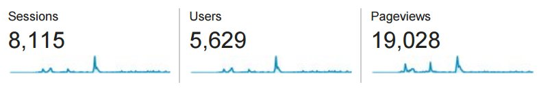

##**Introduction**
kMITRA is a student-run monthly magazine by the students of [KMIT](http://kmit.in/). The magazine aspires to cover and inform readers about science, culture, art, technology, and issues relevant to the student commmunity, in a cohesive manner. [http://kmit.in/emagazine](http://kmit.in/emagazine)

I am the sole developer and designer of kMITRA, something I really enjoy decicating my time to. Here's a brief overview and history of the website from a technical standpoint.

>This is how we *roll*

####**The Logo:**

##**Back-End**
The website runs on the [WordPress](https://wordpress.org) platform. 
We chose WordPress as our back-end because we believe in the future of WordPress, as a simple, community driven, scalable, and endlessly extensible publishing platform. 
More than **71 million** people can’t be wrong. Also because it's free, lol.

##**Content** 
Most of the content, such as text and images is hosted on KMIT's own webservers, organized and indexed by the WordPress CMS(Content Management System).
Videos, however, are hosted on our [YouTube channel](https://www.youtube.com/channel/UCVy33lRaRxA8ACd-QU2Gumw). 
Newsletters are distributed to subscribers in bulk via a [Mailchimp](https://mailchimp.com/) server.

##**Baby Steps**
####**Plugins**
kMITRA was required to be a periodical magazine, with new issues every month. 
By default, WordPress does not provide management functionality for periodicals.
After days of head scratching, we finally found a [plugin](https://wordpress.org/plugins/issuem/) that provided a basic structure for handling issue-based publications within WordPress. 
This meant that I did not have to start coding from scratch. A few custom functions later, we were satisfied with its functionality.

####**Design**
We then moved on to design. While deciding the font, we were looking for type that had excellent legibility and was optimized for all screen sizes; 
so we chose the [Open Sans](https://www.google.com/fonts/specimen/Open+Sans) typeface for all the text and [Playfair Display](https://www.google.com/fonts/specimen/Playfair+Display) typeface for bold, eye-catching Headlines.

####**Layout**
The layout or UI is the first thing a reader notices when looking at a website. We needed something elegant and functional for kMITRA, with generous use of negative space to let the user focus on the actual content. It was fairly easy to achieve the desired look of the website using a base theme and custom CSS. 

####**Migration**
Since the old magazine, Vipasana, was located at `kmit.in/newsletter` for a long time, search engines such as google provided links for Vipasana articles using the old URL. This lead to a number of `404: NOT FOUND` error messages. 
I handled these requests by modifying the `.htaccess` file of KMIT's Apache server to include `HTTP 301` redirects.
#####example:
<!---->

`RedirectMatch 301 /newsletter/(.*) http://kmit.in/emagazine/$1`
 
`Redirectmatch 301 /kmitra http://kmit.in/emagazine/`

##**Reception**
kMITRA launched on 22nd October last year, with only a Facebook [page](https://facebook.com/kmitrakmit) for publicity. The response was, and continues to be tremendous. It has exceeded all of our expectations. The entire team of kMITRA has been overjoyous. The dedication of our readers gives us immense hope for the future of the magazine and a sense of responsibility towards delivering quality and engaging content.

####**Here are some stats:**

>Note: These numbers are from Feb-Jun 2015 only. That's when we started collecting data.

##**Lessons Learnt**
Developing kMITRA has taught me a great deal about the technologies behind it. I now see how exhilarating solving problems can be. It has helped me communicate better with my team and put forward my ideas and views in a coherent manner. I look forward to continue contributing to the magazine during my limited time at KMIT.
  
##**Technologies used**
####**Front-End**
* HTML
* CSS
* JavaScript

####**Back-End**
* PHP
* Apache HTTP Server
* WordPress CMS/CDN

Thanks for reading :)

*until next time..*
