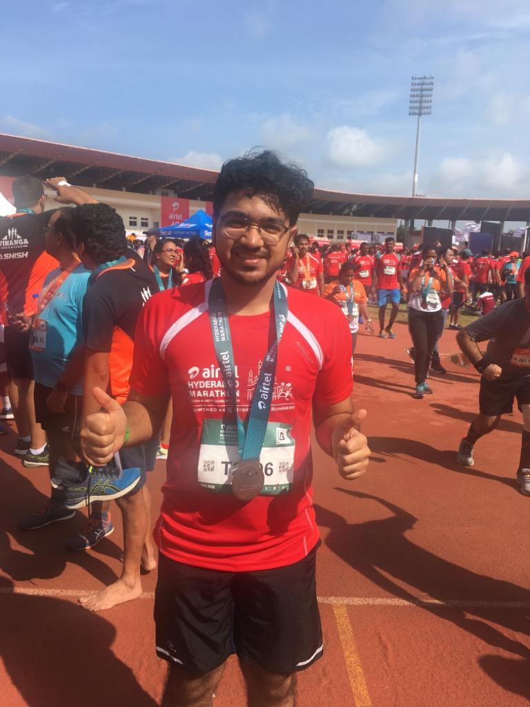

Well, not really a marathon, but a 10K

One of my big goals for this year was to have an active lifestyle, and I decided that running a marathon would be a good step (pun intended) in that direction. And so, on a wet Sunday in August, I participated in **Airtel Hyderabad Marathon** — the biggest annual running event in the city — in the 10K category.

## False Starts

I had originally planned on running a Half marathon. As soon as the dates were announced, I made an overly optimistic (given my sedentary lifestyle) workout plan that included a week of warm-up runs, 10 weeks of training, and new shoes for the big day.
c
I used Runkeeper[^1] to track my runs and form the very first run, I struggled to get a good pace. As we often do, I dismissed it as teething problems, and kept pushing though the pain for a week. By the end of the week, I had severe pain in my shinbones — even simply stomping my feet hurt!

And so I decided to take some time off to heal my legs, thinking that perhaps I'd exerted myself too much too soon. A week into my 10 week training, I was forced to take a month's break.

Then one day, I fell down the stairs. Yup. Slipped on soap water and crashed hard on my back. Got bruises all along my back, thigh and butt. Thankfully, nothing happened to my neck or head. 

Naturally, I headed to a doctor and was told that it wasn't serious and everything would heal in good time. It was there that I found out that I had Vitamin D3 deficiency and my joints were to some degree *[hypermobile](https://en.wikipedia.org/wiki/Hypermobility_(joints))*. This meant that I had to be careful when I exercise my joints, especially my knees.

However, the doctor encouraged me to take part in the marathon after completing my physiotherapy.

##  Ready, Set, Go!

By this point I knew that I couldn't possibly take part in the Half Marathon with virtually zero training, so I registered to take part in the 10K event. And then I didn't run even once until race day.

Armed with Gatorade, glucose pills, and creeping anxiety, I reached my starting point at Hitex Exhibition Center, along with 8,000 others taking part in the 10K leg of the marathon.

The run itself was brutal, exhausting, but ultimately cathartic.

I managed to not stop at any point, and just keep running or walking or even just moving. There were multiple points along the route where volunteers were handing out water, bananas, sliced lemons(?!), glucose powder, electrolytes etc. They were cheering and hooting to encourage runners to keep moving. 

The best cheer squad by far was a row of little schoolchildren who were singing, clapping, and high-fiving the runners. They put a smile on everyone's faces. 

I could barely walk by the end, but all I knew is that I had to complete it, if only to prove to myself that I could. I stumbled my way into the finish line and collected my medal, feeling relieved at last. The official time was 1:21:16, which is "not great, but not terrible"[^2]. ¯\\\_(ツ)\_/¯

[^1]: The voice assisted run training is pretty helpful. Not sure if it's worth the ~₹620 weekly fee though.
[^2]: Just like 3.6 Roentgen, in *[Chernobyl](https://www.youtube.com/watch?v=M6kYod3_gwk)* 

